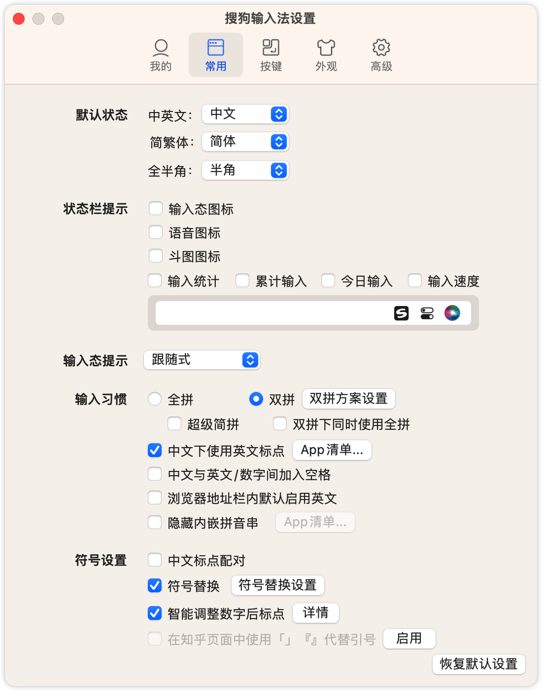
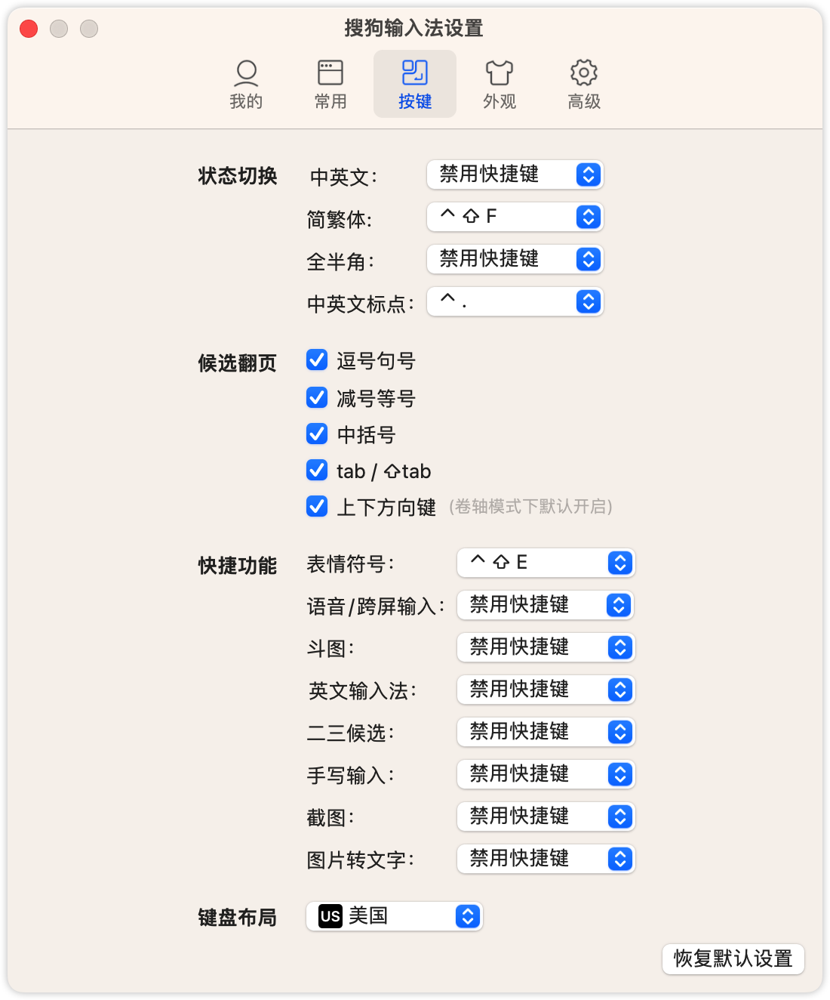
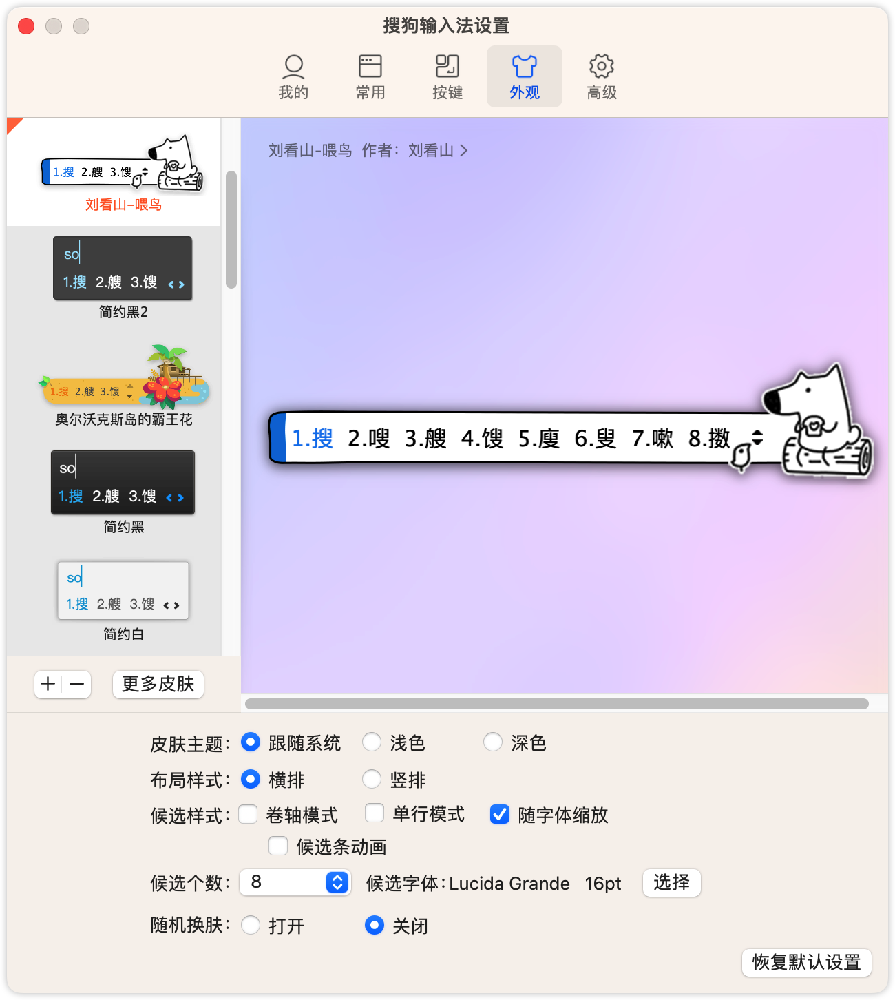
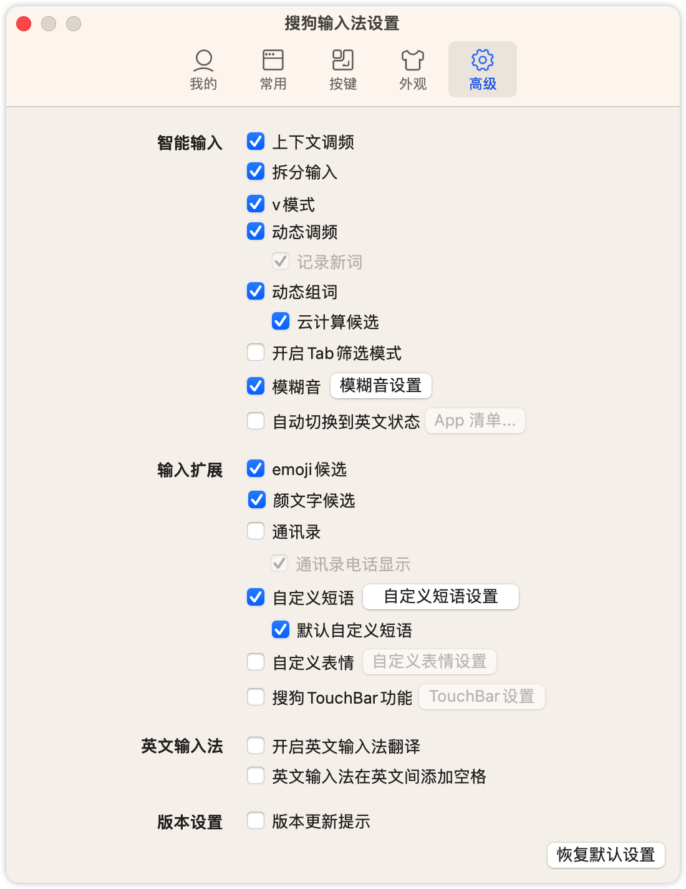

# 搜狗输入法配置

## 自定义短语

- [搜狗输入法添加小鹤音形单字全码方案 | insv の blog](https://blog.insv.xyz/sougou-xhyx)
- 其他用户个性化短语 `custom.ini` 为防止隐私泄露保存在Notion中 [搜狗输入法 phrases.ini](https://www.notion.so/insv2/phrases-ini-a0482c4cbbf744869db023a8c1dd658c) ，记得配合 `xhxy-单字全码.custom.ini` 使用 

## 配置截图

- [刘看山皮肤备份](./configs/sougou-xhyx/刘看山-喂鸟.mssf)

