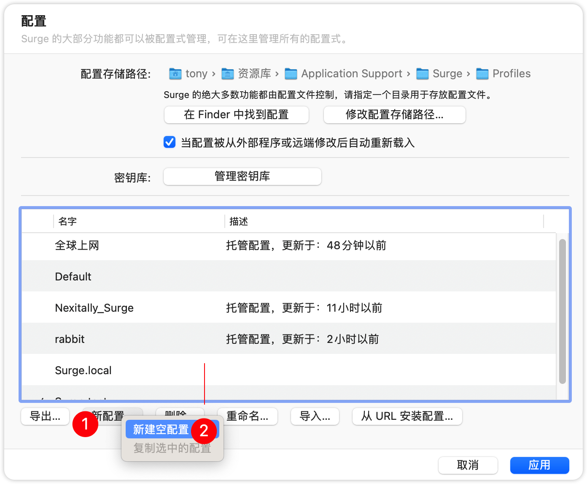
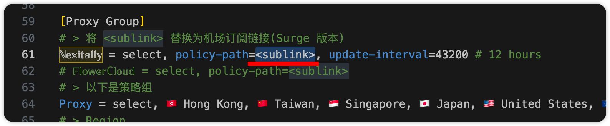

# Surge 自定义配置使用指南

## 1. 安装 Surge(通过 Homebrew, 略)

## 2. Surge 中操作

2.1 打开 Surge 主窗口，「更多」->「配置」

2.2 点击「新配置」->「新建空配置」

2.3 输入新配置名字，点击好的

2.4 选择刚刚创建的文件，点击「在文本编辑器中编辑」

## 3. 复制模板文件并修改订阅地址

模板文件：https://github.com/insv23/MacOS/blob/main/configs/Surge.custom.conf

3.1 复制

3.2 粘贴到 `Surge.local.conf` 文件中

3.3 修改订阅地址

## 4. 切换配置

